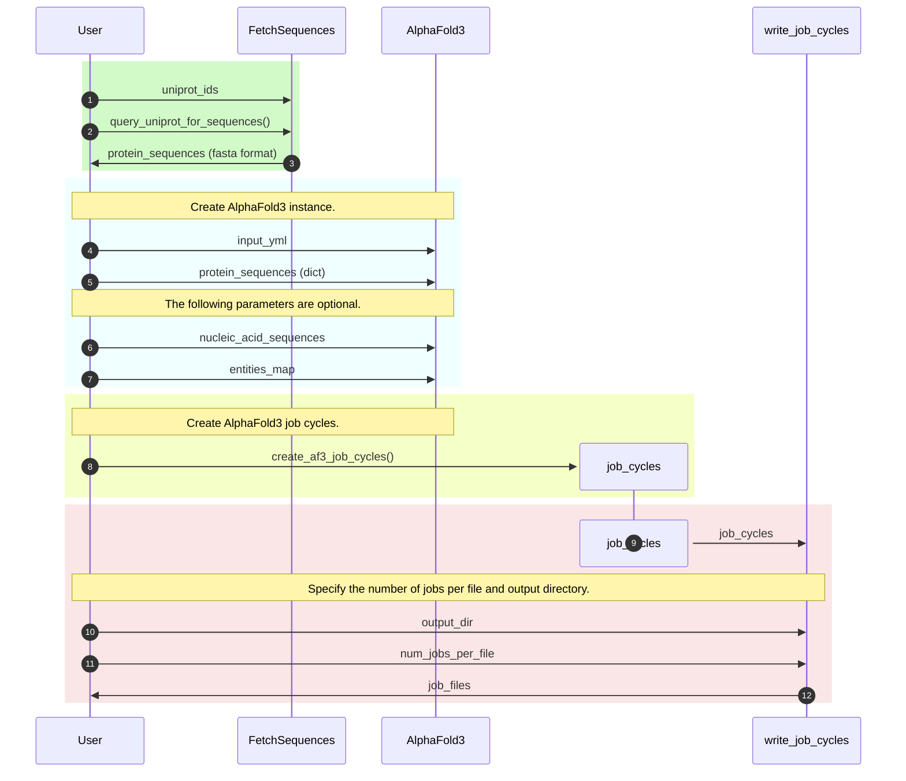

```mermaid
sequenceDiagram
    autonumber
    participant User
    participant FetchSequences
    participant AlphaFold3

    rect rgb(210, 250, 200)
    User->>FetchSequences: uniprot_ids
    User->>FetchSequences: query_uniprot_for_sequences()
    FetchSequences->>User: protein_sequences (fasta format)
    end

    rect rgb(240, 255, 255)
    note over User, AlphaFold3: Create AlphaFold3 instance.
    User->>AlphaFold3: input_yml
    User->>AlphaFold3: protein_sequences (dict)
    note over User, AlphaFold3: The following parameters are optional.
    User->>AlphaFold3: nucleic_acid_sequences
    User->>AlphaFold3: entities_map
    end

    rect rgb(245, 255, 200)
    note over User, AlphaFold3: Create AlphaFold3 job cycles.
    create participant job_cycles
    User->>job_cycles: create_af3_job_cycles()
    end

    rect rgb(250, 230, 230)
    destroy job_cycles
    job_cycles->>write_job_cycles: job_cycles
    note over User, write_job_cycles: Specify the number of jobs per file and output directory.
    User->>write_job_cycles: output_dir
    User->>write_job_cycles: num_jobs_per_file
    write_job_cycles->>User: job_files
    end
```