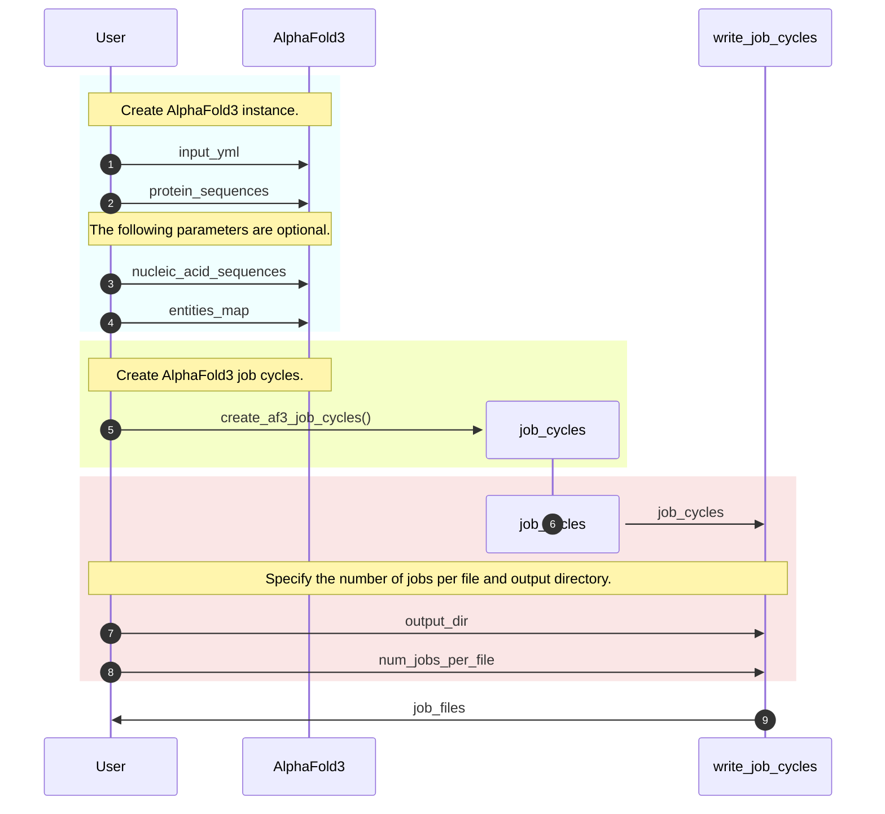

```mermaid
sequenceDiagram
    autonumber
    participant User
    participant AlphaFold3

    rect rgb(240, 255, 255)
    note over User, AlphaFold3: Create AlphaFold3 instance.
    User->>AlphaFold3: input_yml
    User->>AlphaFold3: protein_sequences
    note over User, AlphaFold3: The following parameters are optional.
    User->>AlphaFold3: nucleic_acid_sequences
    User->>AlphaFold3: entities_map
    end
    rect rgb(245, 255, 200)
    note over User, AlphaFold3: Create AlphaFold3 job cycles.
    create participant job_cycles
    User->>job_cycles: create_af3_job_cycles()
    end
    rect rgb(250, 230, 230)
    destroy job_cycles
    job_cycles->>write_job_cycles: job_cycles
    note over User, write_job_cycles: Specify the number of jobs per file and output directory.
    User->>write_job_cycles: output_dir
    User->>write_job_cycles: num_jobs_per_file
    end
    write_job_cycles->>User: job_files
```
