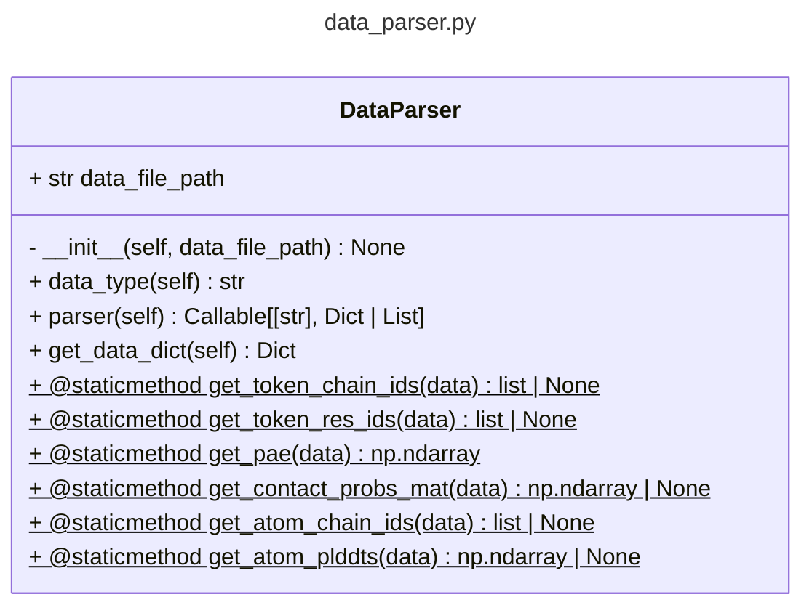

```mermaid
---
title: data_parser.py
---
classDiagram
    class DataParser {
        + str data_file_path
        - \_\_init__(self, data_file_path) None
        + data_type(self) str
        + parser(self) Callable[[str], Dict | List]
        + get_data_dict(self) Dict
        + @staticmethod get_token_chain_ids(data) list | None$
        + @staticmethod get_token_res_ids(data) list | None$
        + @staticmethod get_pae(data) np.ndarray$
        + @staticmethod get_contact_probs_mat(data) np.ndarray | None$
        + @staticmethod get_atom_chain_ids(data) list | None$
        + @staticmethod get_atom_plddts(data) np.ndarray | None$
    }
```
