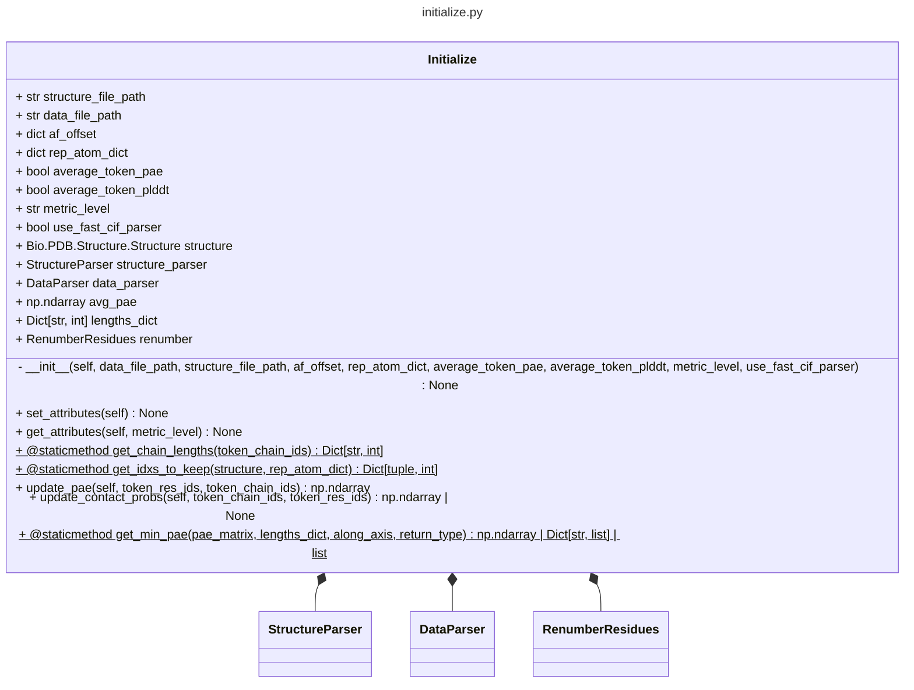

```mermaid
---
title: initialize.py
---
classDiagram
    class Initialize {
        + str structure_file_path
        + str data_file_path
        + dict af_offset
        + dict rep_atom_dict
        + bool average_token_pae
        + bool average_token_plddt
        + str metric_level
        + bool use_fast_cif_parser
        + Bio.PDB.Structure.Structure structure
        + StructureParser structure_parser
        + DataParser data_parser
        + np.ndarray avg_pae
        + Dict[str, int] lengths_dict
        + RenumberResidues renumber
        - \_\_init__(self, data_file_path, structure_file_path, af_offset, rep_atom_dict, average_token_pae, average_token_plddt, metric_level, use_fast_cif_parser) None
        + set_attributes(self) None
        + get_attributes(self, metric_level) None
        + @staticmethod get_chain_lengths(token_chain_ids) Dict[str, int]$
        + @staticmethod get_idxs_to_keep(structure, rep_atom_dict) Dict[tuple, int]$
        + update_pae(self, token_res_ids, token_chain_ids) np.ndarray
        + update_contact_probs(self, token_chain_ids, token_res_ids) np.ndarray | None
        + @staticmethod get_min_pae(pae_matrix, lengths_dict, along_axis, return_type) np.ndarray | Dict[str, list] | list$
    }

    Initialize *-- StructureParser

    Initialize *-- DataParser

    Initialize *-- RenumberResidues
```
