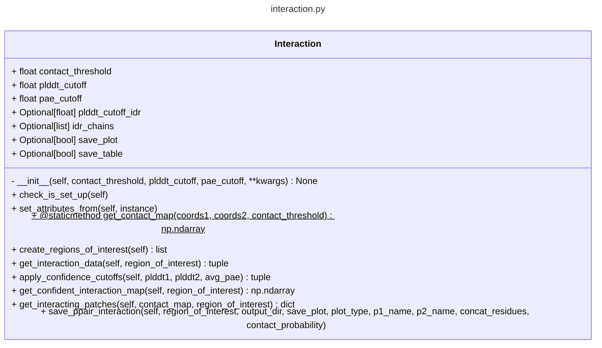

```mermaid
---
title: interaction.py
---
classDiagram
    class Interaction {
        + float contact_threshold
        + float plddt_cutoff
        + float pae_cutoff
        + Optional[float] plddt_cutoff_idr
        + Optional[list] idr_chains
        + Optional[bool] save_plot
        + Optional[bool] save_table
        - \_\_init__(self, contact_threshold, plddt_cutoff, pae_cutoff, **kwargs) None
        + check_is_set_up(self)
        + set_attributes_from(self, instance)
        + @staticmethod get_contact_map(coords1, coords2, contact_threshold) np.ndarray$
        + create_regions_of_interest(self) list
        + get_interaction_data(self, region_of_interest) tuple
        + apply_confidence_cutoffs(self, plddt1, plddt2, avg_pae) tuple
        + get_confident_interaction_map(self, region_of_interest) np.ndarray
        + get_interacting_patches(self, contact_map, region_of_interest) dict
        + save_ppair_interaction(self, region_of_interest, output_dir, save_plot, plot_type, p1_name, p2_name, concat_residues, contact_probability)
    }
```
