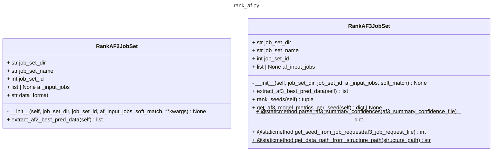

```mermaid
---
title: rank_af.py
---
classDiagram
    class RankAF2JobSet {
        + str job_set_dir
        + str job_set_name
        + int job_set_id
        + list | None af_input_jobs
        + str data_format
        - \_\_init__(self, job_set_dir, job_set_id, af_input_jobs, soft_match, **kwargs) None
        + extract_af2_best_pred_data(self) list
    }

    class RankAF3JobSet {
        + str job_set_dir
        + str job_set_name
        + int job_set_id
        + list | None af_input_jobs
        - \_\_init__(self, job_set_dir, job_set_id, af_input_jobs, soft_match) None
        + extract_af3_best_pred_data(self) list
        + rank_seeds(self) tuple
        + get_af3_model_metrics_per_seed(self) dict | None
        + @staticmethod parse_af3_summary_confidences(af3_summary_confidence_file) dict$
        + @staticmethod get_seed_from_job_request(af3_job_request_file) int$
        + @staticmethod get_data_path_from_structure_path(structure_path) str$
    }
```
