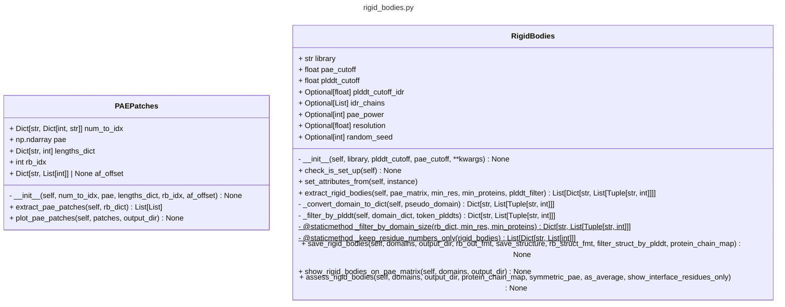

```mermaid
---
title: rigid_bodies.py
---
classDiagram
    class PAEPatches {
        + Dict[str, Dict[int, str]] num_to_idx
        + np.ndarray pae
        + Dict[str, int] lengths_dict
        + int rb_idx
        + Dict[str, List[int]] | None af_offset
        - \_\_init__(self, num_to_idx, pae, lengths_dict, rb_idx, af_offset) None
        + extract_pae_patches(self, rb_dict) List[List]
        + plot_pae_patches(self, patches, output_dir) None
    }

    class RigidBodies {
        + str library
        + float pae_cutoff
        + float plddt_cutoff
        + Optional[float] plddt_cutoff_idr
        + Optional[List] idr_chains
        + Optional[int] pae_power
        + Optional[float] resolution
        + Optional[int] random_seed
        - \_\_init__(self, library, plddt_cutoff, pae_cutoff, **kwargs) None
        + check_is_set_up(self) None
        + set_attributes_from(self, instance)
        + extract_rigid_bodies(self, pae_matrix, min_res, min_proteins, plddt_filter) List[Dict[str, List[Tuple[str, int]]]]
        - \_convert_domain_to_dict(self, pseudo_domain) Dict[str, List[Tuple[str, int]]]
        - \_filter_by_plddt(self, domain_dict, token_plddts) Dict[str, List[Tuple[str, int]]]
        - @staticmethod \_filter_by_domain_size(rb_dict, min_res, min_proteins) Dict[str, List[Tuple[str, int]]]$
        - @staticmethod \_keep_residue_numbers_only(rigid_bodies) List[Dict[str, List[int]]]$
        + save_rigid_bodies(self, domains, output_dir, rb_out_fmt, save_structure, rb_struct_fmt, filter_struct_by_plddt, protein_chain_map) None
        + show_rigid_bodies_on_pae_matrix(self, domains, output_dir) None
        + assess_rigid_bodies(self, domains, output_dir, protein_chain_map, symmetric_pae, as_average, show_interface_residues_only) None
    }
```
