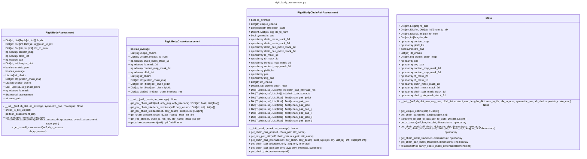

```mermaid
---
title: rigid_body_assessment.py
---
classDiagram
    class RigidBodyAssessment {
        + Dict[str, List[Tuple[str, int]]] rb_dict
        + Dict[str, Dict[int, Dict[str, int]]] num_to_idx
        + Dict[int, Dict[str, str | int]] idx_to_num
        + np.ndarray contact_map
        + np.ndarray plddt_list
        + np.ndarray pae
        + Dict[str, int] lengths_dict
        + bool symmetric_pae
        + bool as_average
        + List[str] idr_chains
        + Dict[str, str] protein_chain_map
        + List[str] unique_chains
        + List[Tuple[str, str]] chain_pairs
        + np.ndarray rb_mask
        + dict overall_assessment
        + str save_path
        - \_\_init__(self, rb_dict, as_average, symmetric_pae, **kwargs) None
        + check_is_set_up(self)
        + perform_assessment(self)
        + set_attributes_from(self, instance)
        + save_rb_assessment(self, rb_c_assess, rb_cp_assess, overall_assessment, save_path)
        + get_overall_assessment(self, rb_c_assess, rb_cp_assess)
    }

    class RigidBodyChainAssessment {
        + bool as_average
        + List[str] unique_chains
        + Dict[int, Dict[str, int]] idx_to_num
        + np.ndarray chain_mask_stack_1d
        + np.ndarray rb_mask_1d
        + np.ndarray contact_map_mask_1d
        + np.ndarray plddt_list
        + List[str] idr_chains
        + Dict[str, str] protein_chain_map
        + Dict[str, list | float] per_chain_plddt
        + Dict[str, list | float] per_chain_iplddt
        + Dict[str, List[int] | int] per_chain_interface_res
        - \_\_init__(self, _mask, as_average) None
        + get_per_chain_plddt(self, only_avg, only_interface) Dict[str, float | List[float]]
        + get_per_chain_interface_residues(self, only_count) Dict[str, int | List[int]]
        + get_per_chain_residues(self, only_count) Dict[str, int | List[int]]
        + get_chain_attr(self, chain_id, attr_name) float | str | int
        + get_res_attr(self, chain_id, res_idx, attr_name) float | str | int
        + get_chain_assessment(self) pd.DataFrame
    }

    class RigidBodyChainPairAssessment {
        + bool as_average
        + List[str] unique_chains
        + List[Tuple[str, str]] chain_pairs
        + Dict[int, Dict[str, int]] idx_to_num
        + bool symmetric_pae
        + np.ndarray chain_mask_stack_1d
        + np.ndarray chain_mask_stack_2d
        + np.ndarray chain_pair_mask_stack_1d
        + np.ndarray chain_pair_mask_stack_2d
        + np.ndarray rb_mask_1d
        + np.ndarray rb_mask_2d
        + np.ndarray contact_map_mask_1d
        + np.ndarray contact_map_mask_2d
        + np.ndarray plddt_list
        + np.ndarray pae
        + np.ndarray avg_pae
        + List[str] idr_chains
        + Dict[str, str] protein_chain_map
        + Dict[Tuple[str, str], List[int] | int] chain_pair_interface_res
        + Dict[Tuple[str, str], List[int] | int] chain_pair_contacts
        + Dict[Tuple[str, str], List[float] | float] chain_pair_iplddt
        + Dict[Tuple[str, str], List[float] | float] chain_pair_pae
        + Dict[Tuple[str, str], List[float] | float] chain_pair_ipae
        + Dict[Tuple[str, str], List[float] | float] chain_pair_pae_ij
        + Dict[Tuple[str, str], List[float] | float] chain_pair_pae_ji
        + Dict[Tuple[str, str], List[float] | float] chain_pair_ipae_ij
        + Dict[Tuple[str, str], List[float] | float] chain_pair_ipae_ji
        - \_\_init__(self, _mask, as_average) None
        + get_chain_pair_attr(self, chain_pair, attr_name)
        + get_res_pair_attr(self, chain_pair, res_pair, attr_name)
        + get_chain_pair_interface(self, per_chain, only_count) Dict[Tuple[str, str], List[int] | int | Tuple[int, int]]
        + get_chain_pair_plddt(self, only_avg, only_interface)
        + get_chain_pair_pae(self, only_avg, only_interface, symmetric)
        + get_chain_pair_assessment(self)
    }

    class _Mask {
        + Dict[str, List[int]] rb_dict
        + Dict[str, Dict[int, Dict[str, int]]] num_to_idx
        + Dict[int, Dict[str, int]] idx_to_num
        + Dict[str, int] lengths_dict
        + np.ndarray contact_map
        + np.ndarray plddt_list
        + bool symmetric_pae
        + List[str] idr_chains
        + Dict[str, str] protein_chain_map
        + np.ndarray pae
        + np.ndarray avg_pae
        + np.ndarray contact_map_mask_2d
        + np.ndarray contact_map_mask_1d
        + np.ndarray rb_mask_2d
        + np.ndarray rb_mask_1d
        + np.ndarray chain_mask_stack_1d
        + np.ndarray chain_mask_stack_2d
        + np.ndarray chain_pair_mask_stack_1d
        + np.ndarray chain_pair_mask_stack_2d
        - \_\_init__(self, rb_dict, pae, avg_pae, plddt_list, contact_map, lengths_dict, num_to_idx, idx_to_num, symmetric_pae, idr_chains, protein_chain_map) None
        + get_unique_chains(self) List[str]
        + get_chain_pairs(self) List[Tuple[str, str]]
        + transform_rb_dict_to_idxs(self, rb_dict) Dict[str, List[int]]
        + get_rb_mask(self, lengths_dict, dimensions) np.ndarray
        + get_chain_mask(self, chain_id, lengths_dict, dimensions) np.ndarray
        + get_chain_pair_mask(self, chain_id_1, chain_id_2, lengths_dict, dimensions) np.ndarray
        + get_chain_mask_stack(self, dimensions) np.ndarray
        + get_chain_pair_mask_stack(self, dimensions) np.ndarray
        + @staticmethod sanity_check_mask_dimensions(dimensions)$
    }
```
