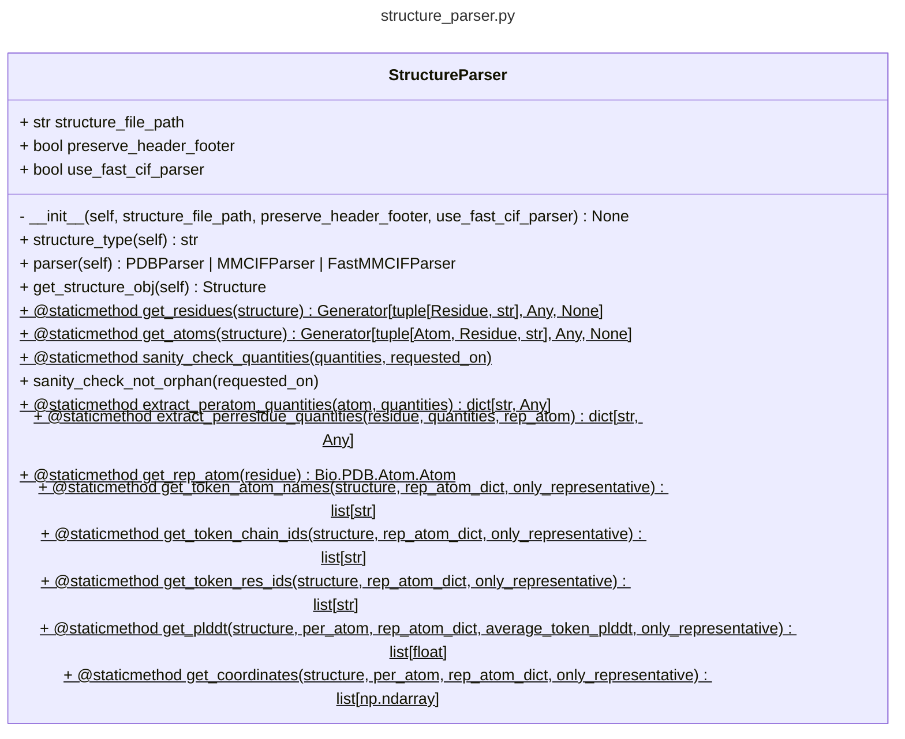

```mermaid
---
title: structure_parser.py
---
classDiagram
    class StructureParser {
        + str structure_file_path
        + bool preserve_header_footer
        + bool use_fast_cif_parser
        - \_\_init__(self, structure_file_path, preserve_header_footer, use_fast_cif_parser) None
        + structure_type(self) str
        + parser(self) PDBParser | MMCIFParser | FastMMCIFParser
        + get_structure_obj(self) Structure
        + @staticmethod get_residues(structure) Generator[tuple[Residue, str], Any, None]$
        + @staticmethod get_atoms(structure) Generator[tuple[Atom, Residue, str], Any, None]$
        + @staticmethod sanity_check_quantities(quantities, requested_on)$
        + sanity_check_not_orphan(requested_on)
        + @staticmethod extract_peratom_quantities(atom, quantities) dict[str, Any]$
        + @staticmethod extract_perresidue_quantities(residue, quantities, rep_atom) dict[str, Any]$
        + @staticmethod get_rep_atom(residue) Bio.PDB.Atom.Atom$
        + @staticmethod get_token_atom_names(structure, rep_atom_dict, only_representative) list[str]$
        + @staticmethod get_token_chain_ids(structure, rep_atom_dict, only_representative) list[str]$
        + @staticmethod get_token_res_ids(structure, rep_atom_dict, only_representative) list[str]$
        + @staticmethod get_plddt(structure, per_atom, rep_atom_dict, average_token_plddt, only_representative) list[float]$
        + @staticmethod get_coordinates(structure, per_atom, rep_atom_dict, only_representative) list[np.ndarray]$
    }
```
