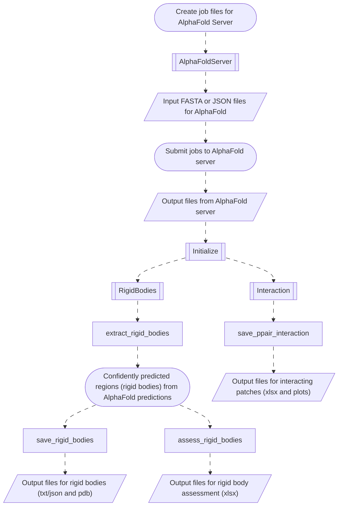

# AF-Pipeline

[](https://codecov.io/gh/isblab/af_pipeline)


## Installation

- Clone the repository
    ```bash
    git clone --recursive https://github.com/isblab/af_pipeline.git
    ```

  If cloned without `--recursive` flag, do the following.
  ```bash
  git submodule init
  git submodule update
  ```

- Run [`setup.py`](./setup.py)
  ```bash
  python setup.py
  ```

## Overview

[AF-Pipeline](https://isblab.github.io/af_pipeline/) is a package to assist in
AlphaFold2 and AlphaFold3 related tasks. These include:
- Creating input files for prediction (for AlphaFold server or AlphaFold2 or Colabfold)
- Ranking the predictions based on confidence metrics
- Extracting confidently predicted regions from the predictions
- Extracting interacting regions from the predictions

The workflow for the entire pipeline can be viewed [here](#workflow).

See also:
- [Changelog](changelog.md)
- [Contributing](contributing.md)
- [Documentation](https://isblab.github.io/af_pipeline/)

## Usage

- Example scripts are available in the [examples](./examples/) directory.

## Workflow



## Additional Information

**License**: GPLv3

**Testable**: Yes