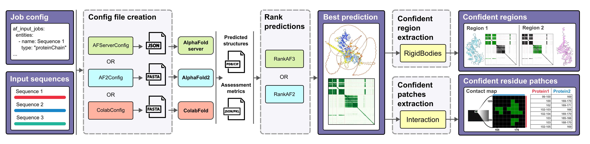
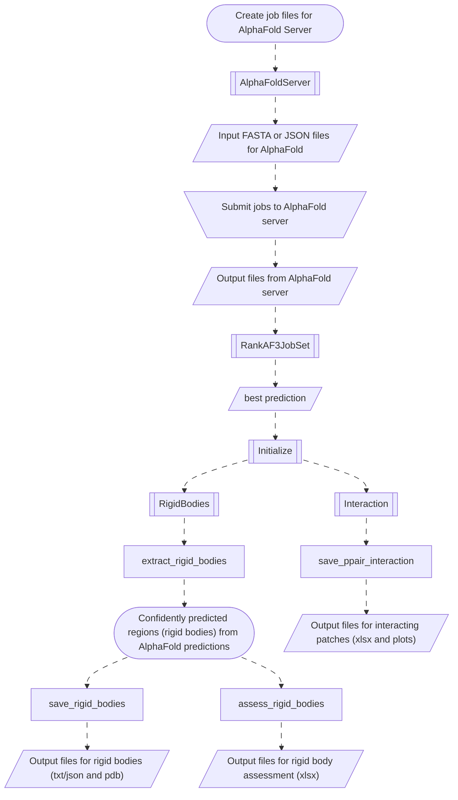

# AF-Pipeline

[](https://codecov.io/gh/isblab/af_pipeline)


<hr>

## Overview & features



[AF-Pipeline](https://isblab.github.io/af_pipeline/) is a package to assist in
AlphaFold2[^af2] and AlphaFold3[^af3] related tasks. These include:
- Creating input files for prediction (for AlphaFold server[^afserver] or AlphaFold2[^af2] or Colabfold[^colabfold])
- Ranking the predictions based on confidence metrics
- Extracting **confidently predicted regions** from the predictions (based on [pae_to_domains](https://github.com/tristanic/pae_to_domains)[^pae_to_domains] package by Tristan Croll)
- Extracting **interacting residue patches** from the predictions

The workflow for the entire pipeline can be viewed [here](#workflow).

<hr>

## Installation

- Clone the repository
    ```bash
    git clone --recursive https://github.com/isblab/af_pipeline.git
    ```

  If cloned without `--recursive` flag, do the following.
  ```bash
  git submodule init
  git submodule update
  ```

- Run [`setup.py`](./setup.py)
  ```bash
  python setup.py
  ```

<hr>

## Tutorial

- Refer to the following Google colab notebook and slides (presented at Computational Biology Summer School 2026 at NCBS Bangalore)

  [](https://colab.research.google.com/drive/18Xddb_Wm-_GVpCC1m0qA3p1SiTE2yGVF?usp=drive_link)
  [](https://github.com/isblab/af_pipeline/blob/main/tutorials/AF_pipeline_NCBS_summer_school_2026.pdf)

<hr>

## Documentation

- For a detailed explanation of different modules and their capabilites in AF-Pipeline, see [Documentation](https://isblab.github.io/af_pipeline/)

- See also:
  - [Changelog](changelog.md)
  - [Contributing](contributing.md)

<hr>

## Quick usage

- Refer to the scripts available in the [examples](./examples/) directory.
  Before running the scripts, make sure you unzip [`AF_predictions.zip`](./examples/input/AF_predictions.zip)
  ```bash
  unzip ./input/AF_predictions.zip -d input/
  ```

- Create `JSON` job files for AlphaFold server [^afserver].
  ```bash
  python create_af_jobs.py \\
      -i ./input/config.yaml \\
      -o ./output/af_input_jobs \\
      -p ./input/protein_sequences.fasta \\
      -n ./input/nucleic_acid_sequences.fasta \\
      -t AF3 # you can replace this with AF2 or ColabFold
  ```

- Upload the `JSON` files to AlphaFold server [^afserver] and download and extract the results.

- Rank the output predictions.
  ```bash
  python rank_af_predictions.py \\
      -i ./output/af_input_jobs.json \\
      -o ./output \\
      -t AF3 \\
      --pred_dirs ./input/AF_predictions/AF3
  ```

- Extract interacting patches from the predictions.
  ```bash
  python extract_interacting_patches.py \\
      --i ./input/best_af_predictions.json \\
      --o ./output/interacting_patches \\
      --interaction_pae_cutoff 5.0 \\
      --plddt_cutoff 70.0 \\
      --contact_threshold 8.0
  ```

- Extract confidently predicted regions from the predictions.
  ```bash
  python extract_rigid_bodies.py \\
      -i ./input/best_af_predictions.json \\
      -o ./output/rigid_bodies \\
      --apply_plddt_filter True
  ```

[^afserver]: AlphaFold Server. alphafoldserver.com. Available at: https://alphafoldserver.com/.

[^af3]: Abramson, J. et al. Accurate structure prediction of biomolecular interactions with AlphaFold 3. Nature 630, 493–500 (2024). (https://alphafoldserver.com/)

[^af2]: Jumper, J. et al. Highly Accurate Protein Structure Prediction with Alphafold. Nature 596, 583–589 (2021).

[^colabfold]: Mirdita, M. et al. ColabFold: making protein folding accessible to all. Nature Methods 19, 679–682 (2022). (https://colab.research.google.com/github/sokrypton/ColabFold/blob/main/AlphaFold2.ipynb)

[^pae_to_domains]: pae_to_domains: Graph-based community clustering approach to extract protein domains from a predicted aligned error matrix. Tristan Croll (https://github.com/tristanic/pae_to_domains)

<hr>

## Workflow



<hr>

## Additional Information

**License**: [GPLv3](LICENSE.txt)

**Testable**: Yes
